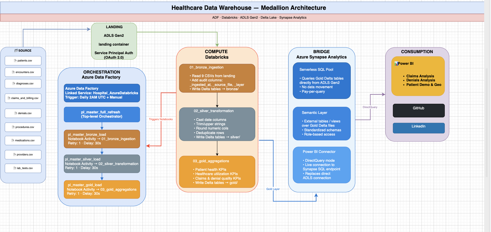
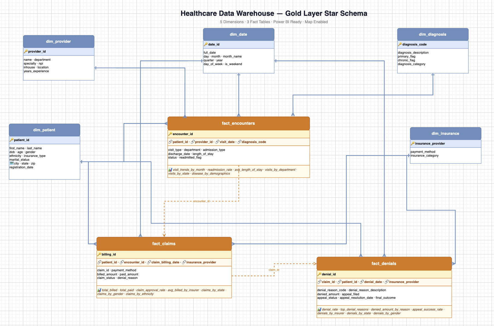

# 🏥 Healthcare Data Warehouse — End-to-End Data Engineering Project

## 📋 Overview

A production-grade, end-to-end data engineering pipeline built on Microsoft Azure. This project demonstrates a complete **Medallion Architecture** (Bronze → Silver → Gold) using:

- **Azure Data Factory** for orchestration and scheduling
- **Azure Databricks** for distributed data transformation (PySpark + SQL)
- **ADLS Gen2** as the Delta Lake storage layer
- **Azure Synapse Analytics** as the serving layer
- **Power BI** for business intelligence dashboards

The pipeline processes **9 healthcare datasets (~550K rows)** and answers 3 core business questions around patient demographics, claims analysis, and denial root cause analysis.

---

## 🏗️ Architecture

---

## 🛠️ Tech Stack

| Layer | Technology | Purpose |
|-------|-----------|---------|
| Orchestration | Azure Data Factory | Pipeline scheduling, sequencing, triggers |
| Compute | Azure Databricks (PySpark + SQL) | Data transformation and aggregation |
| Storage | ADLS Gen2 (Delta Lake) | Medallion Architecture storage |
| Serving | Azure Synapse Analytics | Serverless SQL views for BI connectivity |
| Authentication | Service Principal (OAuth 2.0) | Secure storage access |
| Reporting | Power BI Desktop | Business intelligence dashboards |
| Version Control | GitHub | Code and documentation |

---

## 📊 Datasets

| Dataset | Rows | Key Columns |
|---------|------|-------------|
| patients | 60,000 | demographics, city, state, zip |
| encounters | 70,000 | visit_date, visit_type, readmitted_flag |
| diagnoses | 70,000 | diagnosis_code, chronic_flag |
| claims_and_billing | 70,000 | billed_amount, paid_amount, claim_status |
| denials | 5,998 | denial_reason_code, appeal_status, final_outcome |
| procedures | 126,021 | procedure_code, procedure_cost |
| medications | 94,498 | drug_name, cost |
| providers | 1,491 | specialty, department, location |
| lab_tests | 54,537 | test_name, test_result, status |
| **Total** | **~550K** | |

---

## 🥉 Bronze Layer

**Notebook:** `01_bronze_ingestion`

- Reads 9 CSVs from ADLS Gen2 landing container
- Adds 3 audit columns: `_ingested_at`, `_source_file`, `_layer`
- Writes Delta tables to bronze container
- No transformations — raw data preserved as-is

---

## 🥈 Silver Layer

**Notebook:** `02_silver_transformation`

| Transformation | Description |
|----------------|-------------|
| Date casting | String → proper date types using `to_date()` |
| String standardization | `TRIM()` + `UPPER()` for consistency |
| Numeric rounding | Financial columns rounded to 2 decimal places |
| Deduplication | By ID column or full row depending on data quality |

**Key Finding:** Source data ID columns are not always unique — deduplication strategy validated per table.

**Date format fix:** `claims_and_billing` used `DD-MM-YYYY HH:MM` format — fixed using explicit format string.

---

## 🥇 Gold Layer — Star Schema

**Notebook:** `03_gold_aggregations`

### Dimension Tables

| Table | Rows | Key Columns |
|-------|------|-------------|
| dim_patient | 60,000 | age_group, gender, ethnicity, city, state, zip |
| dim_provider | 1,491 | specialty, department, location |
| dim_date | 90 | month, quarter, year, day_of_week |

### Fact Tables

| Table | Rows | Key Metrics |
|-------|------|-------------|
| fact_encounters | 70,000 | visit trends, readmission rate, length of stay |
| fact_claims | 70,000 | billed/paid amounts, claim status, demographics |
| fact_denials | 5,998 | denial reasons, appeal rates, final outcomes |

---

## ⚙️ ADF Orchestration

| Pipeline | Description |
|----------|-------------|
| `01_bronze_master_pipeline` | Triggers Databricks bronze notebook |
| `02_silver_master_pipeline` | Triggers Databricks silver notebook |
| `03_gold_master_pipeline` | Triggers Databricks gold notebook |
| `pl_master_full_refresh` | Chains all 3 in sequence |

**Trigger:** Daily at 2:00 AM UTC

---

## 📈 Power BI Dashboard

3-page interactive dashboard connected via Azure Synapse Analytics Serverless SQL:

### Page 1 — Claims Analysis
- Total Billed: **$112.9M** | Total Paid: **$72.8M** | Total Claims: **70K** | Total Denials: **6K**
- Claims Status: PAID 91.43% | DENIED 8.57%
- Billed Amount by Insurance Provider (CIGNA highest at $16.4M)
- Claims trend by month (peak March at $34M)
- Billed Amount by Gender (Female $67M vs Male $46M)

### Page 2 — Denials Analysis
- Total Denied: **$9.65M** | Appeal Filed Rate: **89.96%** | Appeal Success Rate: **80.04%**
- Top denial reason: Duplicate claim/service
- Final Outcome: PAID 80.04% | WRITTEN OFF 10.08% | REPROCESSED 9.88%
- Denied Amount by Insurance Provider (MEDICAID highest at $1.54M)
- Denials by Gender and Ethnicity

### Page 3 — Patient Demographics & Geography
- Billed Amount by State treemap (CA dominates at $81.44M)
- Claims by Ethnicity (Hispanic 27.9K, White 25.3K, Asian 16.9K)
- Claims by Age Group (65+ leads at 30.03%)
- Claims by Age Group and Gender

---

## 🔐 Security

- **Service Principal** (OAuth 2.0) for Databricks → ADLS Gen2 access
- **Databricks Managed Identity** for Unity Catalog external locations
- **Synapse Serverless SQL** with database scoped credentials
- No storage account keys used in production code

---

## ☁️ Azure Infrastructure

| Resource | Name |
|----------|------|
| Resource Group | `rg_hospital_dwh` |
| Storage Account | `adlshospitaldwh` (ADLS Gen2) |
| Databricks Workspace | `hospital-Databricls` |
| Databricks Cluster | `Hospital-Cluster2026` |
| Data Factory | `adf-hospital-2026` |
| Synapse Workspace | `synapse-hospitaldwh` |

---

## 💡 Key Learnings

- **Service Principal + ADLS Gen2** is the enterprise standard for secure storage access
- **Medallion Architecture** separates raw, clean, and business-ready data cleanly
- **Source data quality** must be validated — ID columns are not always unique, date formats vary
- **Unity Catalog** requires proper external location setup with managed identity credentials
- **Synapse Serverless SQL** is an excellent serving layer for Delta Lake tables
- **ADF + Databricks** is a powerful orchestration + compute pattern widely used in enterprise

---

## 📊 Business Insights

1. **91.43% claim approval rate** — 8.57% denial rate represents $9.65M in denied claims
2. **Duplicate claims** are the #1 denial reason — process improvement opportunity
3. **80% appeal success rate** — suggests many initial denials are incorrect
4. **California** drives 72% of all billed amounts
5. **Hispanic patients** have the highest claim volume and denial amounts
6. **65+ age group** represents 30% of all claims
7. **Female patients** billed $67M vs Male $46M

---

## 👤 Author

**Linda Sylvie**
Data Analyst → Data Engineer
Indianapolis, IN

[GitHub](https://github.com) | [LinkedIn](https://linkedin.com)
