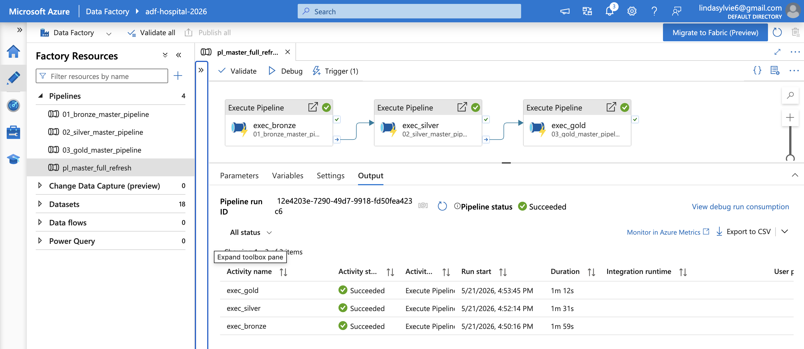
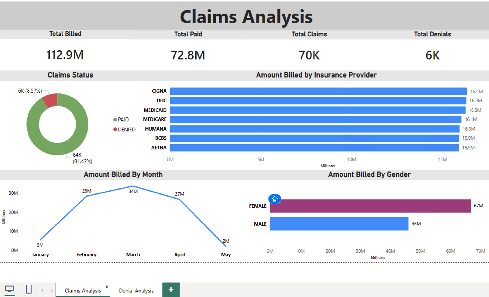
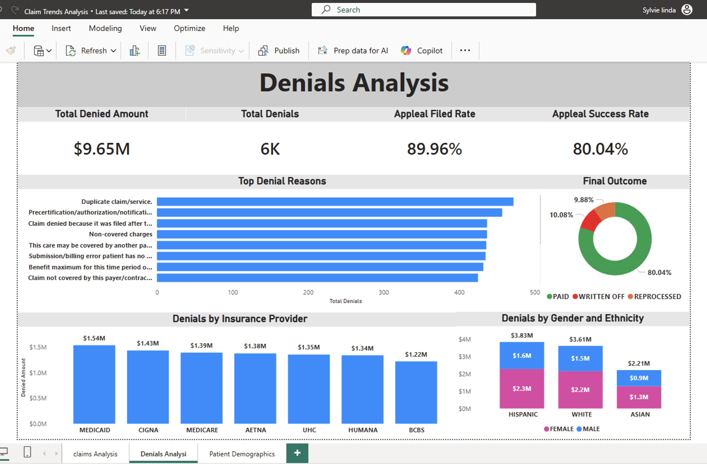
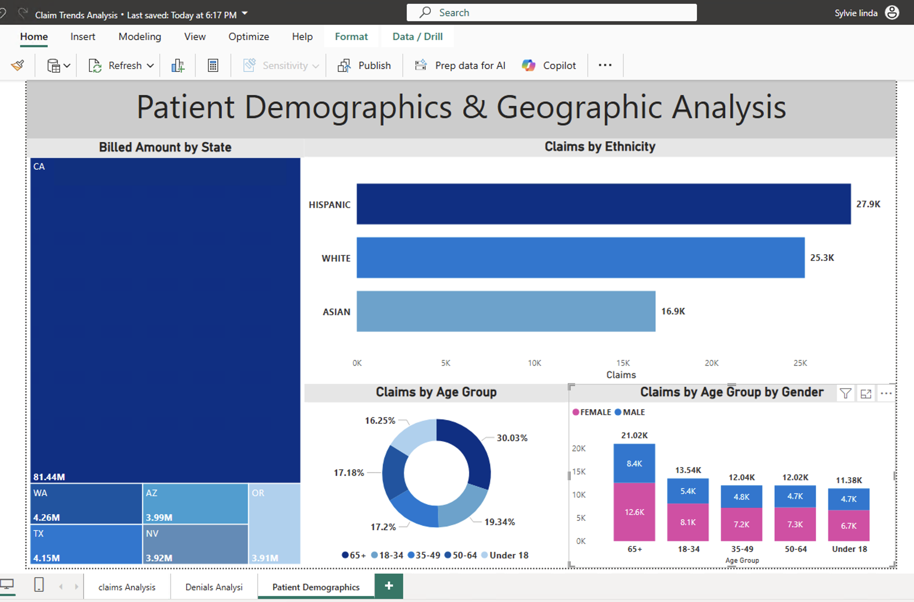

# 🏥 🏥 Healthcare Data Warehouse | Azure Medallion Architecture (ADF + Databricks + Synapse + Power BI)


  

# Healthcare Revenue Cycle Analytics Platform

Enterprise-scale Azure Data Engineering project built using Azure Data Factory, Databricks, ADLS Gen2, Synapse Analytics, and Power BI.

This solution implements a modern Medallion Architecture to ingest, transform, govern, and analyze healthcare claims and denial data for operational and financial reporting.


## 📚 Table of Contents

- [📋 Overview](#-overview)
- [🏗️ Architecture](#️-architecture)
- [🛠️ Tech Stack](#️-tech-stack)
- [📊 Datasets](#-datasets)
- [🥉 Bronze Layer](#-bronze-layer)
- [🥈 Silver Layer](#-silver-layer)
- [🥇 Gold Layer : Star Schema](#-gold-layer--star-schema)
- [⚙️ ADF Orchestration](#️-adf-orchestration)
- [📈 Power BI Dashboard](#-power-bi-dashboard)
- [🔐 Security](#-security)
- [☁️ Azure Infrastructure](#️-azure-infrastructure)
- [💡 Key Learnings](#-key-learnings)
- [📊 Business Insights](#-business-insights)
- [🔧 Troubleshooting: Date Columns NULL](#-troubleshooting-date-columns-showing-null-in-power-bi)
- [👤 Author](#-author)

## 📋 Overview

A production-grade, end-to-end data engineering pipeline built on Microsoft Azure. This project demonstrates a complete **Medallion Architecture** (Bronze → Silver → Gold) using:

- **Azure Data Factory** for orchestration and scheduling
- **Azure Databricks** for distributed data transformation (PySpark + SQL)
- **ADLS Gen2** as the Delta Lake storage layer
- **Azure Synapse Analytics** as the serving layer
- **Power BI** for business intelligence dashboards

The pipeline processes **9 healthcare datasets (~550K rows)** and answers 3 core business questions around patient demographics, claims analysis, and denial root cause analysis.

### 📋 Project Highlights

* Built enterprise Medallion Architecture (Bronze / Silver / Gold)
* Automated orchestration using Azure Data Factory
* Processed healthcare claims and denials data with Databricks
* Implemented Delta Lake for scalable storage and ACID transactions
* Created Synapse semantic layer for enterprise reporting
* Developed interactive Power BI dashboards for revenue cycle analytics
* Designed dimensional models and healthcare KPI aggregations
* Enabled DirectQuery reporting architecture


### Business Value

Healthcare organizations face significant revenue leakage due to denied claims, delayed reimbursements, and inconsistent payer processing.

This platform centralizes operational healthcare data into a governed analytics environment to provide:

* Visibility into denial trends
* Claims processing performance tracking
* Insurance payer analysis
* Revenue cycle KPIs
* Executive reporting capabilities
* Improved operational decision-making

---

## 🏗️ Architecture


---

## 🛠️ Tech Stack

| Layer | Technology | Purpose |
|-------|-----------|---------|
| Orchestration | Azure Data Factory | Pipeline scheduling, sequencing, triggers |
| Compute | Azure Databricks (PySpark + SQL) | Data transformation and aggregation |
| Storage | ADLS Gen2 (Delta Lake) | Medallion Architecture storage |
| Serving | Azure Synapse Analytics | Serverless SQL views for BI connectivity |
| Authentication | Service Principal (OAuth 2.0) | Secure storage access |
| Reporting | Power BI Desktop | Business intelligence dashboards |
| Version Control | GitHub | Code and documentation |

---

## 📊 Datasets

| Dataset | Rows | Key Columns |
|---------|------|-------------|
| patients | 60,000 | demographics, city, state, zip |
| encounters | 70,000 | visit_date, visit_type, readmitted_flag |
| diagnoses | 70,000 | diagnosis_code, chronic_flag |
| claims_and_billing | 70,000 | billed_amount, paid_amount, claim_status |
| denials | 5,998 | denial_reason_code, appeal_status, final_outcome |
| procedures | 126,021 | procedure_code, procedure_cost |
| medications | 94,498 | drug_name, cost |
| providers | 1,491 | specialty, department, location |
| lab_tests | 54,537 | test_name, test_result, status |
| **Total** | **~550K** | |

---

## 🥉 Bronze Layer

**Notebook:** `01_bronze_ingestion`

- Reads 9 CSVs from ADLS Gen2 landing container
- Adds 3 audit columns: `_ingested_at`, `_source_file`, `_layer`
- Writes Delta tables to bronze container
- No transformations — raw data preserved as-is

---

## 🥈 Silver Layer

**Notebook:** `02_silver_transformation`

| Transformation | Description |
|----------------|-------------|
| Date casting | String → proper date types using `to_date()` |
| String standardization | `TRIM()` + `UPPER()` for consistency |
| Numeric rounding | Financial columns rounded to 2 decimal places |
| Deduplication | By ID column or full row depending on data quality |

**Key Finding:** Source data ID columns are not always unique: deduplication strategy validated per table.

**Date format fix:** `claims_and_billing` used `DD-MM-YYYY HH:MM` format : fixed using explicit format string.

---

## 🥇 Gold Layer : Star Schema


**Notebook:** `03_gold_aggregations`

### Dimension Tables

| Table | Rows | Key Columns |
|-------|------|-------------|
| dim_patient | 60,000 | age_group, gender, ethnicity, city, state, zip |
| dim_provider | 1,491 | specialty, department, location |
| dim_date | 90 | month, quarter, year, day_of_week |

### Fact Tables

| Table | Rows | Key Metrics |
|-------|------|-------------|
| fact_encounters | 70,000 | visit trends, readmission rate, length of stay |
| fact_claims | 70,000 | billed/paid amounts, claim status, demographics |
| fact_denials | 5,998 | denial reasons, appeal rates, final outcomes |

---

## ⚙️ ADF Orchestration




| Pipeline | Description |
|----------|-------------|
| `01_bronze_master_pipeline` | Triggers Databricks bronze notebook |
| `02_silver_master_pipeline` | Triggers Databricks silver notebook |
| `03_gold_master_pipeline` | Triggers Databricks gold notebook |
| `pl_master_full_refresh` | Chains all 3 in sequence |

**Trigger:** Daily at 2:00 AM UTC

---

## 📈 Power BI Dashboard

3-page interactive dashboard connected via Azure Synapse Analytics Serverless SQL:

### Page 1 — Claims Analysis



- Total Billed: **$112.9M** | Total Paid: **$72.8M** | Total Claims: **70K** | Total Denials: **6K**
- Claims Status: PAID 91.43% | DENIED 8.57%
- Billed Amount by Insurance Provider (CIGNA highest at $16.4M)
- Claims trend by month (peak March at $34M)
- Billed Amount by Gender (Female $67M vs Male $46M)

### Page 2 — Denials Analysis

 

- Total Denied: **$9.65M** | Appeal Filed Rate: **89.96%** | Appeal Success Rate: **80.04%**
- Top denial reason: Duplicate claim/service
- Final Outcome: PAID 80.04% | WRITTEN OFF 10.08% | REPROCESSED 9.88%
- Denied Amount by Insurance Provider (MEDICAID highest at $1.54M)
- Denials by Gender and Ethnicity

### Page 3 — Patient Demographics & Geography



- Billed Amount by State treemap (CA dominates at $81.44M)
- Claims by Ethnicity (Hispanic 27.9K, White 25.3K, Asian 16.9K)
- Claims by Age Group (65+ leads at 30.03%)
- Claims by Age Group and Gender

---

## 🔐 Security

- **Service Principal** (OAuth 2.0) for Databricks → ADLS Gen2 access
- **Databricks Managed Identity** for Unity Catalog external locations
- **Synapse Serverless SQL** with database scoped credentials
- No storage account keys used in production code

---

## ☁️ Azure Infrastructure

| Resource | Name |
|----------|------|
| Resource Group | `rg_hospital_dwh` |
| Storage Account | `adlshospitaldwh` (ADLS Gen2) |
| Databricks Workspace | `hospital-Databricls` |
| Databricks Cluster | `Hospital-Cluster2026` |
| Data Factory | `adf-hospital-2026` |
| Synapse Workspace | `synapse-hospitaldwh` |

---

## 💡 Key Learnings

- **Service Principal + ADLS Gen2** is the enterprise standard for secure storage access
- **Medallion Architecture** separates raw, clean, and business-ready data cleanly
- **Source data quality** must be validated ; ID columns are not always unique, date formats vary
- **Unity Catalog** requires proper external location setup with managed identity credentials
- **Synapse Serverless SQL** is an excellent serving layer for Delta Lake tables
- **ADF + Databricks** is a powerful orchestration + compute pattern widely used in enterprise

---

## 📊 Business Insights

1. **91.43% claim approval rate** 8.57% denial rate represents $9.65M in denied claims
2. **Duplicate claims** are the #1 denial reason ; process improvement opportunity
3. **80% appeal success rate** : suggests many initial denials are incorrect
4. **California** drives 72% of all billed amounts
5. **Hispanic patients** have the highest claim volume and denial amounts
6. **65+ age group** represents 30% of all claims
7. **Female patients** billed $67M vs Male $46M

---

# 🔧 Troubleshooting: Date Columns Showing NULL in Power BI

## Problem

After building the Gold layer and connecting Power BI via Azure Synapse Analytics, the **Amount Billed by Month** line chart was blank. Investigation revealed that `claim_month`, `claim_month_name`, and `claim_quarter` columns were all **NULL** in the `fact_claims` table.

---

## Root Cause Investigation

### Step 1 : Check Gold layer
```python
df_check = spark.read.format("delta").load(f"{GOLD_PATH}fact_claims")
df_check.select("claim_billing_date", "claim_month", "claim_month_name").show(5)
```
**Result:** All NULL ❌

### Step 2 : Check Silver layer
```python
df = spark.read.format("delta").load(f"{SILVER_PATH}claims_and_billing")
df.select("claim_billing_date").show(5)
```
**Result:** All NULL ❌

### Step 3 : Check Bronze layer
```python
df_bronze = spark.read.format("delta").load(f"{BRONZE_PATH}claims_and_billing")
df_bronze.select("claim_billing_date").show(5)
```
**Result:** All NULL ❌

### Step 4 : Check Raw CSV
```python
df_raw = spark.read.format("csv") \
    .option("header", "true") \
    .option("inferSchema", "true") \
    .load(f"{LANDING_PATH}claims_and_billing.csv")

df_raw.select("claim_billing_date").show(5)
print(df_raw.schema["claim_billing_date"].dataType)
```
**Result:**
```
+--------------------+
|  claim_billing_date|
+--------------------+
|                NULL|
|                NULL|
|                NULL|
+--------------------+
DateType()
```

---

## Root Cause

The raw CSV file uses **`DD-MM-YYYY HH:MM`** date format:
```
06-02-2025 00:00
01-05-2025 00:00
23-02-2025 00:00
```

PySpark's `inferSchema` recognized the column as `DateType()` but **failed to parse** the non-standard format, returning NULL silently instead of raising an error.

The standard `to_date()` function defaults to `YYYY-MM-DD` format — so the Silver transformation was converting an already-NULL value, propagating the issue all the way to Gold.

---

## Fix

### Silver Layer Fix
Read the raw CSV with `inferSchema=false` and parse the date explicitly:

```python
from pyspark.sql.functions import col, to_date, to_timestamp

# Read with inferSchema disabled to preserve raw string values
df_claims_raw = spark.read.format("csv") \
    .option("header", "true") \
    .option("inferSchema", "false") \
    .load(f"{LANDING_PATH}claims_and_billing.csv")

# Parse date using explicit format string
df_claims_silver = df_claims_raw \
    .withColumn(
        "claim_billing_date",
        to_date(to_timestamp(col("claim_billing_date"), "dd-MM-yyyy HH:mm"))
    ) \
    # ... other transformations
```

### Gold Layer — Rebuild fact_claims
After fixing silver, rebuild the gold fact table to pick up the corrected dates:

```python
df_fact_claims = spark.sql("""
    SELECT
        c.*,
        YEAR(c.claim_billing_date) AS claim_year,
        MONTH(c.claim_billing_date) AS claim_month,
        DATE_FORMAT(c.claim_billing_date, 'MMMM') AS claim_month_name,
        QUARTER(c.claim_billing_date) AS claim_quarter
    FROM claims_and_billing c
    LEFT JOIN patients p ON c.patient_id = p.patient_id
""")

df_fact_claims.write.format("delta").mode("overwrite").save(f"{GOLD_PATH}fact_claims")
```

---

## Result After Fix

```
+------------------+------------+----------------+-------------+
|claim_billing_date|claim_month |claim_month_name|claim_quarter|
+------------------+------------+----------------+-------------+
|      2025-03-27  |     3      |     March      |      1      |
|      2025-04-03  |     4      |     April      |      2      |
|      2025-02-17  |     2      |    February    |      1      |
|      2025-03-31  |     3      |     March      |      1      |
+------------------+------------+----------------+-------------+
```

Power BI line chart now shows monthly trends correctly 

---

## Key Learnings

1. **Always validate date formats** in source data before ingestion, don't rely on `inferSchema`
2. **inferSchema can silently return NULL** for dates it can't parse instead of throwing an error
3. **Use `inferSchema=false`** for date columns with non-standard formats and parse explicitly
4. **Test date columns at every layer** (Bronze → Silver → Gold) to catch issues early
5. **NULL propagation** : a NULL in Bronze will flow through to Silver and Gold silently

---

## Prevention

Add a data quality check after Bronze ingestion:

```python
# Data quality check for date columns
def check_null_dates(df, date_columns, table_name):
    for col_name in date_columns:
        null_count = df.filter(df[col_name].isNull()).count()
        total_count = df.count()
        null_pct = (null_count / total_count) * 100
        if null_pct > 10:
            print(f" WARNING: {table_name}.{col_name} has {null_pct:.1f}% NULL values!")
        else:
            print(f" {table_name}.{col_name}: {null_pct:.1f}% NULL ({null_count} rows)")

check_null_dates(df_bronze_claims, ["claim_billing_date"], "claims_and_billing")
```

## 👤 Author

**Sylvie Linda**
Data Analyst → Data Engineer
Indianapolis, IN

[](https://linkedin.com)
[](https://github.com)


[GitHub](https://github.com) | [LinkedIn](https://linkedin.com)
